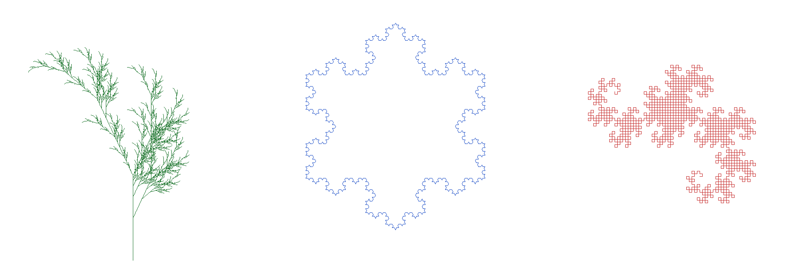

# L-System Turtle Graphics

**Author:** Popescu Petruț-Alin

A C program that reads L-System grammars, expands them, and draws the result on PPM images using turtle graphics. It also supports undo and redo.



## How to run

```bash
make
./lsystem < examples/demo_commands.txt
```

This generates three images: `plant.ppm`, `snowflake.ppm` and `dragon.ppm`.

To check for memory leaks:

```bash
make memcheck
```

## Commands

The program reads one command per line until it gets `EXIT`.

* `LSYSTEM <file>` - loads an L-System from a file
* `DERIVE <n>` - prints the n-th derivation of the loaded L-System
* `LOAD <file>` - loads a PPM image to draw on
* `TURTLE <x> <y> <step> <heading> <angle> <n> <R> <G> <B>` - draws the n-th derivation starting from point (x, y)
* `SAVE <file>` - saves the current image
* `UNDO` / `REDO` - undoes or redoes the last LSYSTEM, LOAD or TURTLE command
* `EXIT` - frees the memory and closes the program

## L-System file format

The first line is the axiom, the second line is the number of rules, and then each rule is written as `symbol replacement`. Example (`examples/plant.lsys`):

```
X
2
X F-[[X]+X]+F[+FX]-X
F FF
```

When drawing, the turtle uses these symbols:

* `F` - move forward and draw a line
* `+` / `-` - turn left / right by the given angle
* `[` / `]` - save / restore the turtle's position and direction

## Implementation

### L-System

To derive an L-System, the program goes through the current string character by character and replaces each character with its rule (or keeps it if it has no rule). This is repeated n times.

### Turtle

For every `F`, the new position of the turtle is calculated with `x + step * cos(angle)` and `y + step * sin(angle)`, and the line between the two points is drawn with **Bresenham's algorithm**. When `[` appears, the current state is pushed onto a stack, and when `]` appears, the last state is popped. This is how the branches of the plant are made.

### Undo and Redo

Before every LSYSTEM, LOAD or TURTLE command, a copy of the current L-System and image is saved on the undo stack. UNDO moves the current state onto the redo stack and restores the last saved one, and REDO does the opposite.

### Memory

All memory is allocated dynamically and freed at the end. The program runs with no memory leaks under Valgrind.